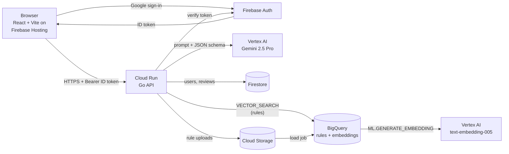
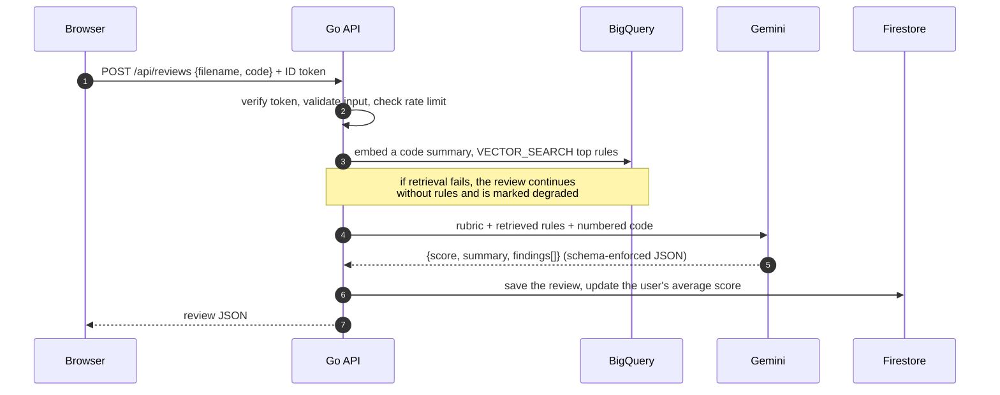

# 24/7 Intelligent Code Reviewer

An automated code reviewer built on Google Cloud. Sign in, submit a source file, and get a structured
review (security issues, bugs, performance, architecture and formatting findings with line numbers)
plus a 1–10 score. Reviews are grounded in a team's **historical review rules**, retrieved by vector
search before every Gemini call, and every review is saved so you can track your score over time.

**Live app:** https://qwiklabs-gcp-02-1805d7f7e612.web.app/

**Working Example**: https://drive.google.com/file/d/1jvS1MQn5BdZToxFw54eqi-0abzWgf7_w/view?usp=sharing

## Features

- **Google sign-in** with Firebase Authentication
- **Structured reviews** from Gemini 2.5 Pro: score, summary, and findings by category and severity, each tied to a line
- **Rule-grounded feedback:** relevant team rules are found by vector search and cited on findings (`rule #3`)
- **History:** every review is saved, with a score trend chart
- **Admin rule management:** admins upload a CSV of rules; the next review uses them immediately
- **Fair use:** per-user hourly review limit

## Contents

- [Architecture](#architecture)
- [Backend](#backend)
- [Frontend](#frontend)
- [Rules CSV format](#rules-csv-format)

---

## Architecture



| Layer | Technology |
|---|---|
| Frontend | React 19, TypeScript, Vite 7, Tailwind CSS, TanStack Query, Firebase Hosting |
| Auth | Firebase Authentication (Google sign-in), ID tokens verified in the API |
| API | Go 1.26 (standard library `net/http`) on Cloud Run |
| Review model | Gemini 2.5 Pro on Vertex AI with JSON-schema output |
| Rule retrieval | BigQuery ML remote embedding model (`text-embedding-005`) + `VECTOR_SEARCH` |
| Data | Firestore (users, reviews), BigQuery (rules), Cloud Storage (rule uploads) |

### How a review works



### How rules are updated

Admins upload a CSV. The API validates it, archives it in Cloud Storage, loads it into a temporary
BigQuery table, embeds only new or changed rules, and `MERGE`s them into the rules table on `id`.
Rules missing from the file are kept, and the next review sees the new rules immediately.

### Design highlights

| Decision | Why |
|---|---|
| Vector search inside BigQuery | No always-on vector index to run; rules and embeddings live in one table and retrieval is one SQL query. |
| Schema-enforced Gemini output | The model can only return JSON in the exact shape the API expects, with fixed categories and severities. |
| Degraded mode | Rule retrieval failing never blocks a review. |
| Per-user data isolation | Every read and write is scoped to the user id from the verified token. |
| Rate limit in a Firestore transaction | Correct across multiple Cloud Run instances and parallel requests. |

---

## Backend

### Folder structure

```
backend/
├── main.go                         # wiring only: config → clients → modules → router
└── internal/
    ├── config/                     # environment variables → Config
    ├── model/                      # plain structs: review, rule, user, rate limit
    ├── platform/                   # GCP client constructors (Gemini, BigQuery, Firestore, Auth, Storage)
    ├── module/                     # business logic, one package per component
    │   ├── review/                 # retrieve rules → Gemini → save; prompt and response schema
    │   ├── rule/                   # vector search retrieval, CSV validation, ingest
    │   ├── user/                   # profiles and review aggregates
    │   └── ratelimit/              # per-user hourly limit
    └── router/                     # HTTP routes and middleware (recover → log → CORS → auth)
```

Dependencies point one way: `router → module → model`, and `module → platform`. The router never talks to
storage or Gemini directly.

### API

| Method | Path | Access | Description |
|---|---|---|---|
| GET | `/health` | public | Health check |
| POST | `/api/reviews` | user | Review one file (`{filename, code}`, up to 200 KB) |
| GET | `/api/reviews` | user | Your reviews, newest first |
| GET | `/api/reviews/{id}` | user | One of your reviews, including the code |
| GET | `/api/users/me` | user | Your profile and review stats |
| GET | `/api/rules` | admin | List rules |
| GET | `/api/rules/search?q=` | admin | Vector search over rules |
| POST | `/api/rules/ingest` | admin | Upload a rules CSV |

Errors are returned as `{"error": "message"}`.

### Run the backend locally

**Prerequisites:** Go 1.26+, the Google Cloud CLI, and a GCP project with Vertex AI, BigQuery, Firestore,
Cloud Storage and Firebase Authentication set up.

```bash
gcloud auth application-default login     # local credentials, no key files

cd backend
cat > .env <<'EOF'
PROJECT_ID=your-project-id
GEMINI_LOCATION=us-central1
GEMINI_MODEL=gemini-2.5-flash
BQ_DATASET=reviewer
BQ_LOCATION=your-region
GCS_BUCKET=your-bucket
CORS_ORIGINS=http://localhost:5173
ADMIN_EMAILS=you@example.com
# DEV_AUTH=true   # local only: skip sign-in and act as a fixed dev user
EOF

go test ./...
go run .                                   # http://localhost:8080
```

| Variable | Default | Purpose |
|---|---|---|
| `PROJECT_ID` | (required) | GCP project |
| `GEMINI_LOCATION` / `GEMINI_MODEL` | `us-central1` / `gemini-2.5-pro` | Vertex AI Gemini |
| `BQ_DATASET` / `BQ_LOCATION` | `reviewer` / `asia-south1` | BigQuery rules dataset |
| `GCS_BUCKET` | (required for rule uploads) | Where uploaded CSVs are archived |
| `ADMIN_EMAILS` | empty | Comma-separated admin emails (verified emails only) |
| `CORS_ORIGINS` | `http://localhost:5173` | Allowed browser origins |
| `RATE_LIMIT_PER_HOUR` | `30` | Reviews per user per hour (`0` disables) |
| `DEV_AUTH` | `false` | Local development only |

---

## Frontend

### Folder structure

```
frontend/
├── vite.config.ts                  # dev proxy /api → localhost:8080
├── tailwind.config.js              # theme tokens → utility classes
├── firebase.json                   # Firebase Hosting config
├── tests/                          # Vitest + Testing Library + msw (mocked API)
└── src/
    ├── App.tsx                     # providers: error boundary, query client, router, auth
    ├── routes/                     # lazy-loaded pages, signed-in and admin-only guards
    ├── config/                     # routes/nav, categories, severities, limits, score bands
    ├── context/                    # auth provider (Firebase user, sign in/out)
    ├── services/                   # HTTP calls (axios), token attached automatically
    ├── hooks/                      # React Query hooks
    ├── types/                      # TypeScript types mirroring the API models
    ├── lib/                        # pure helpers (formatting, language detection, …)
    ├── styles/                     # design tokens (dark theme)
    ├── components/
    │   ├── ui/                     # generic building blocks
    │   ├── layout/                 # app shell, top bar, route guards
    │   └── domain/                 # code view, score badge, severity dot, rule badge
    └── modules/                    # one folder per feature
        ├── auth/                   # sign-in page
        ├── review/                 # new review + result pages
        ├── history/                # score trend chart + past reviews
        ├── admin/                  # rules upload and list (admins only)
        └── profile/                # profile and sign out
```

### Pages

| Route | Page | Access |
|---|---|---|
| `/login` | Sign in with Google | public |
| `/` | New review: paste or upload a file | user |
| `/reviews/:id` | Result: score, findings, highlighted lines, rule badges | user |
| `/history` | Score trend and past reviews | user |
| `/me` | Profile | user |
| `/admin/rules` | Upload and list rules | admin |

### Run the frontend locally

**Prerequisites:** Node 20+, Yarn 1, and the backend running on `localhost:8080`.

```bash
cd frontend
yarn install
cp .env.example .env    # add your Firebase web app config
yarn dev                # http://localhost:5173
```

| Script | What it does |
|---|---|
| `yarn dev` | Dev server with hot reload |
| `yarn build` | Type-check and production build |
| `yarn lint` | ESLint |
| `yarn test:run` | Run the test suite |

---

## Rules CSV format

Header must be exactly `id,type,description`. Quote descriptions that contain commas.

```csv
id,type,description
1,formatting,Avoid single-character variable names — they hurt readability
2,performance,Cache repeated database lookups inside the request loop
3,security,Never interpolate raw user input directly into SQL queries
```

- `id`: positive integer, unique in the file
- `type`: `security`, `bug`, `performance`, `architecture` or `formatting`
- `description`: 1–1000 characters
- File: up to 1 MB and 5000 rules

---
